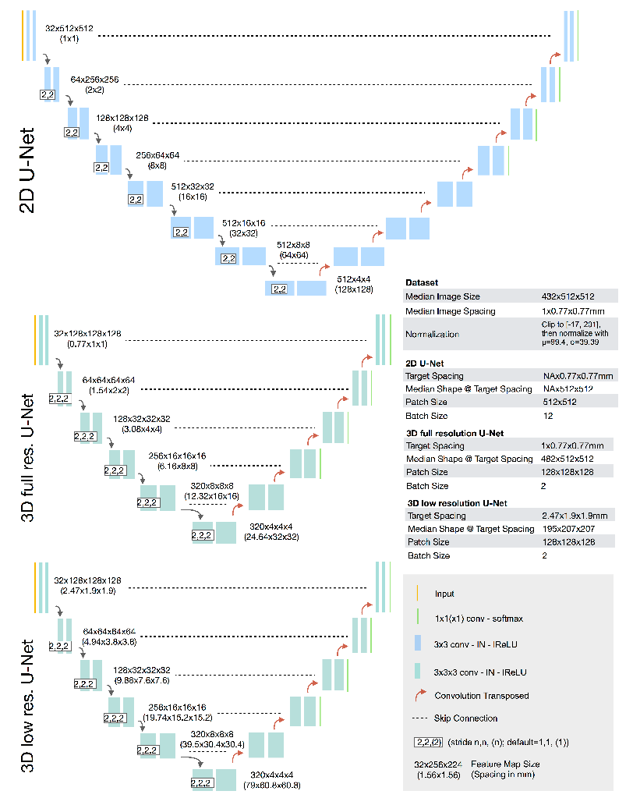

## Introduction
nnUNet (no-new-network-Unet) is proposed to offer a end-to-end training for image segmentation, and achieve state-of-the-art performance in over 10 medical image segmentation tasks, as introduced in paper [Automated Design of Deep Learning Methods for Biomedical Image Segmentation](https://www.nature.com/articles/s41592-020-01008-z). 



Although uuUNet is easy to ulitize in 3D segmentation tasks, it's difficult to train a personal dataset with 2d images. The preparation of dataset should follow strict guidelines. 


## Methods

#### Step1. Prepare Envs

Create vitual environment in conda:
```python
conda create -n nnunet python=3.8
```
Prepare datafloders. 
```
DATASET/nnUNet_raw_data/Task002_Heart
├── nnUNet_preprocessed
├── nnUNet_trained_models
├── nnUNet_raw
│   ├── nnUNet_croped_data
│   ├── nnUNet_raw_data
```

#### Step2. Covert Data
Following guidance here.
> How to use 2D data with nnU-Net
> nnU-Net was originally built for 3D images. It is also strongestwhen applied to 3D segmentation problems because a large proportion of itsdesign choices were built with 3D in mind. Also note that many 2D segmentationproblems, especially in the non-biomedical domain, may benefit from pretrainednetwork architectures which nnU-Net does not support. Still, there is certainlya need for an out of the box segmentation solution for 2D segmentationproblems. And also on 2D segmentation tasks nnU-Net cam perform extremely well!We have, for example, won a 2D task in the cell tracking challenge with nnU-Net(see our Nature Methods paper) and we have also successfully applied nnU-Net tohistopathological segmentation problems. Working with 2D data in nnU-Netrequires a small workaround in the creation of the dataset. Essentially, allimages must be converted to pseudo 3D images (so an image with shape (X, Y)needs to be converted to an image with shape (1, X, Y). The resulting imagemust be saved in nifti format. Hereby it is important to set the spacing of thefirst axis (the one with shape 1) to a value larger than the others. If you areworking with niftis anyways, then doing this should be easy for you. Thisexample here is intended for demonstrating how nnU-Net can be used with’regular’ 2D images. We selected the massachusetts road segmentation datasetfor this because it can be obtained easily, it comes with a good amount oftraining cases but is still not too large to be difficult to handle.

Here is my converting code:
```python
import numpy as np
from batchgenerators.utilities.file_and_folder_operations import *
from nnunet.dataset_conversion.utils import generate_dataset_json
from nnunet.paths import nnUNet_raw_data, preprocessing_output_dir
from nnunet.utilities.file_conversions import convert_2d_image_to_nifti
imgs = '/data/caozheng/*'
masks = '/data/caozheng/*'
root = 'DATASET/imagesTr'
label_root = 'DATASET/labelsTr'

for i in os.listdir(imgs):
    img = os.path.join(imgs, i)
    convert_2d_image_to_nifti(img, os.path.join(root, i.split('.')[0]), is_seg=False)
    print('Finish：'+ i )

for i in os.listdir(masks):
    mask = os.path.join(masks, i)
    convert_2d_image_to_nifti(mask, os.path.join(label_root, i.split('.')[0]), is_seg=True,
                             transform=lambda x: (x > 0).astype(int))
    # transform=lambda x: (x > 0).astype(int) depends on label mode.
    print('Finish：'+ i )
```

Then generate dataset.json file, which can be mantually created or created by default code.
```python
generate_dataset_json(os.path.join(raw, 'dataset.json'), os.path.join(raw, 'imagesTr'),  os.path.join(raw, 'imagesTs'), ('background', 'caries'), {'background':0, 'caries':1}, 'caries_dataset', dataset_description='Private Test!', dataset_release='0.0.1')
```


#### Step3. Move Data to suitable position
The data format of nnUnet is fixed. Task002_Heart is composed of Task ID data name, imagesTr is training data, imagesTs is test data, labelsTr is the label of training data, data sample la_003_0000.nii.gz is marked by case sample name modal.nii. It is composed of gz. Different modals are distinguished by 0000/0001/0002/0003. I set the new task ID to 100.
```
DATASET/nnUNet_raw/nnUNet_raw_data/Task002_Heart
├── dataset.json
├── imagesTr
│   ├── la_003_0000.nii.gz
│   ├── la_004_0000.nii.gz
│   ├── ...
├── imagesTs
│   ├── la_001_0000.nii.gz
│   ├── la_002_0000.nii.gz
│   ├── ...
└── labelsTr
    ├── la_003.nii.gz
    ├── la_004.nii.gz
    ├── ...
```
Our original 2-dimensional data is RGB three-channel, we can regard the RGB three-channel data as three modalities, extract the data of different channels separately, convert the shape to (1, width, height), and save it as 3 with SimpleITK Dimensional data.

#### Step4. Install Packages
Download nnunet code:
```bash
conda activate nnunet
```
```bash
git clone https://github.com/MIC-DKFZ/nnUNet.git
```
and install it.
```bash
pip install -e .
```
Then set a environment variable

```cpp
export nnUNet_raw_data_base="/data/Project/nnUnet/Data/nnUNet_raw"
export nnUNet_preprocessed="/data/Project/nnUnet/Data/nnUNet_preprocessed"
export RESULTS_FOLDER="/data/Project/nnUnet/Data/nnUNet_trained_models"
```


#### Step5. Pre-process and Training
Pre-process will create large amount of data.
```bash
nnUNet_plan_and_preprocess -t 2
```
Here 2 is the task id, which is identified in folder *DATASET/nnUNet_raw/nnUNet_raw_data/Task002_Heart*

Now it's prepared for training! Here we use 5-fold traning, --npz means create softmax prediction.
```bash
CUDA_VISIBLE_DEVICES=6 nnUNet_train 2d nnUNetTrainerV2 Task002_Heart 0  --npz
CUDA_VISIBLE_DEVICES=6 nnUNet_train 2d nnUNetTrainerV2 Task002_Heart 1  --npz
CUDA_VISIBLE_DEVICES=6 nnUNet_train 2d nnUNetTrainerV2 Task002_Heart 2  --npz
CUDA_VISIBLE_DEVICES=6 nnUNet_train 2d nnUNetTrainerV2 Task002_Heart 3  --npz
CUDA_VISIBLE_DEVICES=6 nnUNet_train 2d nnUNetTrainerV2 Task002_Heart 4  --npz
```


